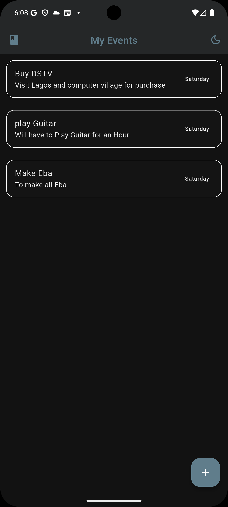

# 📅 AddEvent — Smart Event Manager App

AddEvent is a modern Flutter application designed to help users **create, edit, and manage personal events or tasks** with ease.  
It’s built with **Flutter + BLoC (Cubit)** for clean architecture, **SharedPreferences** for local storage, and supports both **Dark and Light themes** — giving you a smooth and responsive experience on any device.


## 🚀 Features

✅ Add new events (Title, Details, Date)  
✅ Edit and delete existing events  
✅ Swipe-to-delete with Dismissible cards  
✅ Persistent data storage using **SharedPreferences**  
✅ Light Mode 🌞 and Dark Mode 🌙 support  
✅ Beautiful, responsive Material 3 UI  
✅ Built using **Flutter BLoC (Cubit)** pattern for scalable state management  

---

## 🧠 Tech Stack

| Category | Technology Used |
|-----------|----------------|
| Framework | Flutter |
| Language | Dart |
| State Management | **BLoC (Cubit)** |
| Local Storage | **SharedPreferences** |
| UUID Generator | uuid package |
| Architecture | Clean, reactive state updates |
| Theming | Dynamic Dark/Light mode switch via ThemeData |

---

## 🧩 App Structure

```

lib/
├── models/
│   └── event_card_model.dart        # Event model (Title, Details, Date)
├── screens/
│   ├── home_screen.dart             # Displays list of events
│   └── edit_event_dialog.dart       # Edit or add events dialog
├── cubits/
│   └── event/
│       ├── events_cubit.dart        # Core logic for add, edit, delete
│       └── event_state.dart         # State representation
└── main.dart                        # Entry point with theme + provider setup

````

---

## 💾 Data Persistence

AddEvent uses **SharedPreferences** for storing all user-created events.  
Each event is serialized to JSON and saved locally, ensuring your data remains **available after app restarts** — no backend required!

---

## 🎨 Theming

The app supports both **Dark** and **Light** themes automatically based on system settings.  
You can enjoy the interface that best suits your environment — whether working in bright daylight or at night.

---

## ⚙️ How to Run the App

Make sure you have Flutter SDK installed.  
If not, follow [Flutter installation guide](https://docs.flutter.dev/get-started/install).

### 🪜 Step-by-step

1. **Clone this repository**
   ```bash
   git clone https://github.com/yourusername/addevent.git
   cd addevent
````

2. **Install dependencies**

   ```bash
   flutter pub get
   ```

3. **Run on emulator or device**

   ```bash
   flutter run
   ```

4. **Build release APK**

   ```bash
   flutter build apk --release
   ```

   Your release APK will be located at:

   ```
   build/app/outputs/flutter-apk/app-release.apk
   ```

---

## 📦 Download APK

You can try the app instantly by downloading the latest version here 👇
🔗 **[Download AddEvent APK on Google Drive](https://drive.google.com/file/d/1WF2b727uex1xcH9AL5-pNR3iHsRI3JUo/view?usp=sharing)**

> *(Replace with your real Google Drive link — reviewers will click this to install directly.)*

---

## 🧑‍💻 Developer Notes

* Built with love using Flutter ❤️
* Architecture follows **BLoC (Cubit)** pattern for predictable, scalable state management.
* Clean UI and persistent storage designed for fast, smooth user experience.

---

## 📸 Screenshots

| Light Mode | Dark Mode |
| ----------- | ---------- |
|  |  |


## 🏁 Conclusion

AddEvent is a sleek, efficient, and user-friendly event management app that demonstrates:

* Modern Flutter practices
* Persistent local data handling
* Clean state management with BLoC
* Polished Dark/Light theming

🚀 **Download, explore, and enjoy planning smarter!**


**Developed by:** Paul Fidelis
📧 *For inquiries or feedback, reach out via GitHub issues or comments.*


